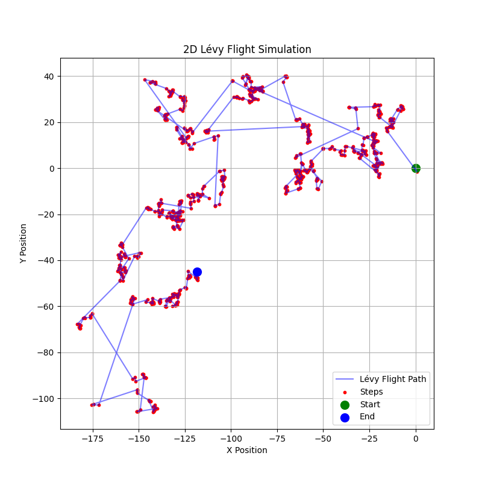
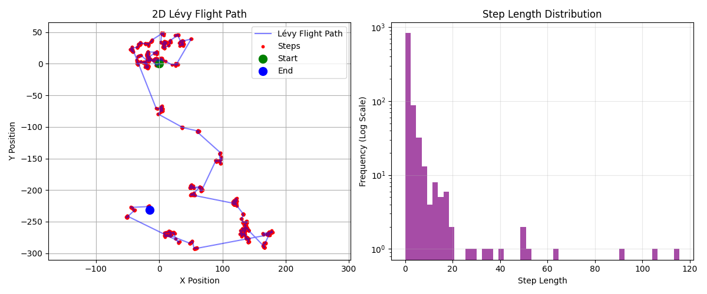

# Lévy Flights: Beyond Random Searches in the Open Ocean

To plot the levy_flight in Python, use the following code, [View `levy.py`](Python/levy.py). 

In the vast, prey-scarce open ocean, predators rely on specialized search strategies to survive. The Lévy walk or Lévy flight—a pattern mixing short, intensive searches with occasional long-distance movements—has emerged as the optimal strategy for finding patchy prey. This approach creates an efficient balance between local exploration and broader area coverage, minimizing energy waste while maximizing hunting success.  

Mathematically, Lévy flights follow a power-law distribution, meaning most movements are short but occasionally interrupted by longer relocations. This matches perfectly with how prey like fish schools are distributed—clustered in rare patches across empty expanses. Tracking studies reveal this pattern in diverse ocean hunters: blue sharks alternate between slow meanders and sudden sprints, while albatrosses fly Lévy-like patterns over featureless seas. Even zooplankton use similar intermittent searches when food is scarce.  

To plot use the following code, [View `levy-flight.py`](Python/levy-flight.py). 

However, Lévy flights lose their advantage when conditions change. In dense prey fields like krill swarms, baleen whales switch to tight, looping movements—a more effective Brownian search strategy. Similarly, predators with advanced senses or intelligence often bypass random searches altogether. Dolphins use echolocation and teamwork, while sharks follow chemical trails directly to food sources.  

The study of these patterns extends beyond biology. Engineers apply Lévy principles to improve underwater drone searches, while conservationists use them to identify critical hunting grounds. These natural strategies demonstrate how evolution optimizes even the simplest movement rules for survival in Earth’s most challenging wilderness.  
